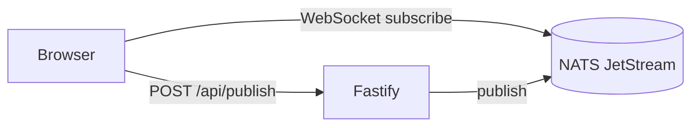

# notiblaster

NATS JetStream notification demo. Browsers subscribe directly to NATS over
WebSocket; Fastify serves the Vue 3 + Vite frontend and exposes a small
`POST /api/publish` endpoint for non-browser publishers.

Host ports: Fastify `3000`, Vite dev `5173`, NATS native `4222`, NATS
WebSocket `8090` (mapped to `8080` inside the container), NATS monitoring
`8222`.



## Prereqs

- Node 20+ and pnpm (via `corepack enable`)
- Docker / podman with compose
- [just](https://just.systems) (`sudo dnf install just`)

## Dev (HMR)

```
just nats          # start NATS
pnpm install
just dev           # Fastify :3000, Vite :5173
```

Open <http://localhost:5173>.

## Fully containerized

```
just up            # builds frontend, then compose up --build
```

Open <http://localhost:3000>.

## Publish from outside the browser

```
just publish notify.broadcast "hello"
# or
curl -X POST http://localhost:3000/api/publish \
  -H 'content-type: application/json' \
  -d '{"subject":"notify.broadcast","message":"hello"}'
```
